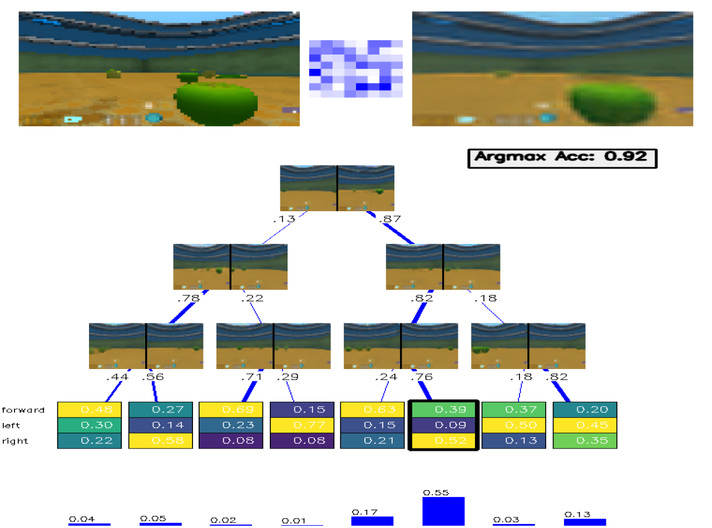

# Explainable Dreamer Agent with Decision Tree Supervision

This project presents a reinforcement learning agent inspired by **DreamerV3**, extended with an explainable policy infrastructure. The architecture integrates **variational world modeling**, **actor-critic learning**, and **supervised decision tree training**, allowing the learned policies to be both performant and interpretable.

---

## 🧠 Problem

Reinforcement learning (RL) agents that operate from high-dimensional observations (e.g., images) often struggle to provide interpretable decisions. Modern agents like DreamerV3 learn latent representations and optimize behavior using neural policies, but their decision processes remain opaque. This project addresses the following challenge:

> **How can we train a high-performance RL agent while providing transparent and interpretable decision-making tools?**

---

## ⚙️ Approach

The core architecture is inspired by **DreamerV3**, and consists of:

- **World Model**: A VAE-like encoder-decoder model that learns compact latent representations from raw observations.
- **Actor-Critic**: A latent-space policy and value network trained via advantage-weighted updates.
- **Transition Model**: A learned model that predicts future latent states, enabling temporal abstraction and representation learning.
- **Explainability Layer**: A supervised decision-tree module that learns to mimic the actor's policy in parallel using collected trajectories.

The agent interacts with a **DeepMind Lab** environment, collecting RGB observations and rewards. At each iteration:

1. **Experience Collection**: The actor interacts with the environment and stores encoded latent states, actions, and outcomes.
2. **World Model Training**: Sequences of observations are used to train the VAE and transition model using a multi-loss objective (reconstruction, reward prediction, continuation, and KL terms).
3. **Policy Optimization**: The actor and critic are updated using advantage-weighted policy gradient and value regression.
4. **Supervised Tree Training**: A batch of experiences is used to train soft, rigid, and classical (sklearn) decision trees to approximate the policy.

This parallel architecture provides the benefits of neural policies (performance, flexibility) and symbolic policies (interpretability, editability).

---

## ✅ Solution

- **Performance**: The agent effectively learns to act from pixels using compact latent states.
- **Interpretability**: The actor’s policy is supervised by decision trees that approximate its behavior. The trees are trained on collected data in parallel and provide symbolic representations of decision rules.
- **Scalability**: The modular infrastructure allows extension with richer explainability modules, such as saliency maps and value-based attribution.

---

## 🔧 Technologies Used

| Component              | Technology             |
|------------------------|------------------------|
| Environment            | [DeepMind Lab](https://github.com/deepmind/lab) |
| Neural Networks        | PyTorch                |
| World Model            | Variational Autoencoder (VAE), MLPs, CNNs |
| Actor-Critic           | Advantage-Weighted Updates |
| Explainability         | Soft, Rigid, and Sklearn Decision Trees |
| Visualization          | OpenCV-based rendering |
| Data Batching          | Custom `Trajectory` and `Batch` classes |
| Logging                | Python `logging`       |

---

## 🖼️ Example: Interpretable Decision Tree Policy

The image below shows a soft decision tree trained to mimic the actor's policy.

At the top, a real environment frame is encoded into a latent representation (center) and reconstructed by the decoder. This latent vector is passed through a differentiable decision tree. Each internal node visualizes the query: "is state similar to this?" which translate into probability of left or right pass. Leaf nodes show the policy distribution over actions (e.g., move forward, turn left, turn right). In this example, the decision tree achieves a high **argmax accuracy** (0.92) in predicting the actor's actions, making it a reliable symbolic approximation.

This visualization allows researchers to interpret which visual features and latent regions contribute to specific decisions in a transparent, structured way.

---

## 🔍 Explainability Infrastructure

The decision tree module receives batches of collected trajectories and trains in parallel to the main agent. It supports:

- **Soft Decision Trees**: Fully differentiable trees for gradient-based optimization.
- **Rigid Trees**: Hard splits with loss-based optimization.
- **Sklearn Trees**: Classical decision tree regressor fitted to mimic the actor policy.

This infrastructure enables **post-hoc policy analysis**, **symbolic distillation**, and **potential editing of learned behaviors**.

---

## 🧾 References

- Hafner et al., *"Mastering Diverse Domains through World Models"*, [DreamerV3 paper](https://arxiv.org/abs/2301.04104)
- Frosst & Hinton, *"Distilling a Neural Network Into a Soft Decision Tree"*

